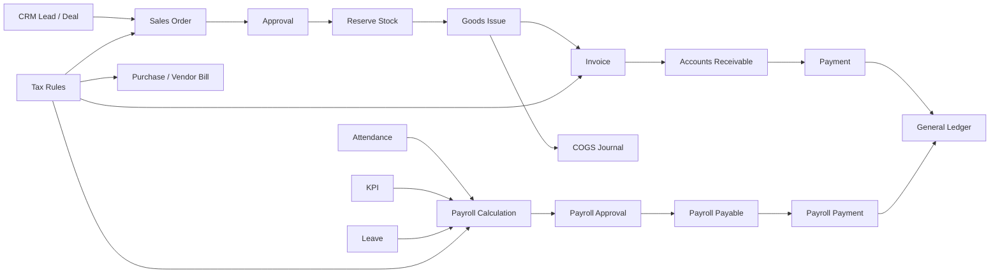

# DashAI ERP + AI

DashAI adalah platform ERP multi-tenant yang menghubungkan modul Product & Inventory, CRM, Sales, Procurement, Finance, HR, Payroll, Tax, Reporting, dan AI Agent dalam satu sistem modular.

Fokus utama DashAI bukan hanya CRUD. Setiap modul dirancang agar dapat:

1. menjaga integritas data bisnis;
2. menjalankan otomasi berbasis aturan sistem;
3. menghasilkan dokumen dan jurnal secara otomatis;
4. tetap memiliki approval, audit trail, dan idempotency;
5. menyediakan data yang aman untuk AI Agent.

## Prinsip Utama

- **System automation first**: proses bisnis penting dijalankan oleh workflow, domain service, scheduler, dan event handler.
- **AI as copilot**: AI memberi analisis, rekomendasi, dan usulan aksi; perubahan kritis tetap melalui policy dan approval.
- **Multi-tenant by default**: seluruh data bisnis harus terikat pada `company_id`.
- **Auditability**: setiap perubahan status, approval, dokumen, perhitungan, dan posting jurnal harus dapat dilacak.
- **Modular monolith first**: satu aplikasi terstruktur dengan batas modul jelas sebelum mempertimbangkan microservices.
- **Double-entry accounting**: transaksi yang berdampak finansial harus menghasilkan jurnal debit-kredit yang seimbang.
- **Configurable business rules**: pajak, KPI, approval, invoice trigger, numbering, dan automation rule tidak boleh hard-coded.

## Stack

### Backend

- FastAPI
- SQLAlchemy Async
- PostgreSQL 16
- Alembic
- Redis
- Qdrant
- JWT + HttpOnly refresh cookie
- Pytest

### Frontend

- Next.js
- React
- TypeScript
- Tailwind CSS
- TanStack Query
- TanStack Table
- Axios
- Recharts
- XLSX
- jsPDF

### Infrastructure

- Docker Compose
- GitHub Actions
- PostgreSQL
- Redis
- Qdrant
- pgAdmin opsional

## Struktur Dokumentasi

| Dokumen | Isi |
|---|---|
| `docs/01_ARCHITECTURE.md` | Arsitektur aplikasi dan batas modul |
| `docs/02_SYSTEM_FLOW.md` | Flow request, command, event, dan projection |
| `docs/03_BUSINESS_AUTOMATION.md` | Flow bisnis lintas modul |
| `docs/04_AUTOMATION_ENGINE.md` | Rule engine, workflow, scheduler, dan outbox |
| `docs/05_DOMAIN_EVENTS.md` | Kontrak event antar-modul |
| `docs/06_DATA_MODEL_EXTENSION.md` | Tabel tambahan yang dibutuhkan |
| `docs/07_CONFIGURATION.md` | Environment dan konfigurasi bisnis |
| `docs/08_DEVELOPMENT.md` | Cara menjalankan dan mengembangkan |
| `docs/09_TESTING_CI.md` | Strategi test dan CI |
| `docs/10_SECURITY_TENANCY.md` | Security, authorization, dan tenant isolation |
| `docs/11_VIBE_CODING_GUIDE.md` | Cara memberi perintah implementasi yang aman |
| `docs/12_IMPLEMENTATION_ROADMAP.md` | Urutan implementasi modul dan otomasi |
| `docs/13_BUSINESS_FLOWS_TO_ADD.md` | Flow ERP tambahan yang disarankan |
| `docs/14_DEFINITION_OF_DONE.md` | Checklist penyelesaian fitur |
| `docs/adr/0001_MODULAR_MONOLITH.md` | Keputusan arsitektur utama |

## Quick Start

```powershell
docker compose `
  -f docker-compose.yml `
  -f docker-compose.hardened.yml `
  up -d --build
```

Cek service:

```powershell
docker compose `
  -f docker-compose.yml `
  -f docker-compose.hardened.yml `
  ps
```

Backend:

```text
http://localhost:8000
```

Frontend:

```text
http://localhost:3000
```

pgAdmin:

```text
http://localhost:5050
```

## Flow Bisnis Inti



## Batasan AI Agent

AI Agent tidak boleh langsung:

- menghapus transaksi;
- mengubah stok;
- menyetujui payroll;
- membayar invoice;
- mem-post jurnal;
- mengganti tax rate;
- memindahkan data tenant.

AI hanya boleh menjalankan aksi tersebut setelah:

1. policy mengizinkan;
2. user memiliki permission;
3. approval terpenuhi;
4. idempotency key tersedia;
5. audit event dibuat.

## Status Kesiapan

DashAI saat ini cocok dikembangkan sebagai:

- modular ERP;
- SaaS multi-tenant;
- AI-assisted reporting;
- workflow-driven business system;
- automation-first business platform.


## AI Agent Demo

DashAI menyediakan analyst read-only, AI-assisted invoice draft, dan AI-assisted financial report dengan human confirmation serta rule fallback. Panduan konfigurasi dan flow ada di [`docs/AI_AGENT_DEMO.md`](docs/AI_AGENT_DEMO.md).
