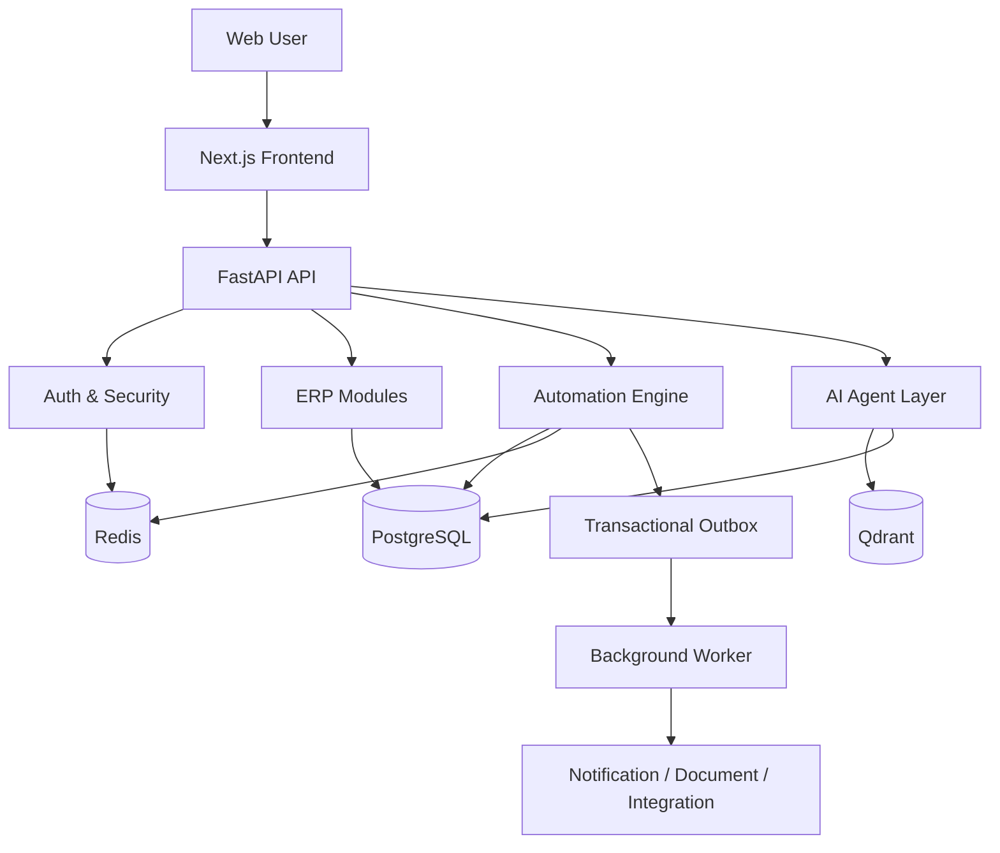
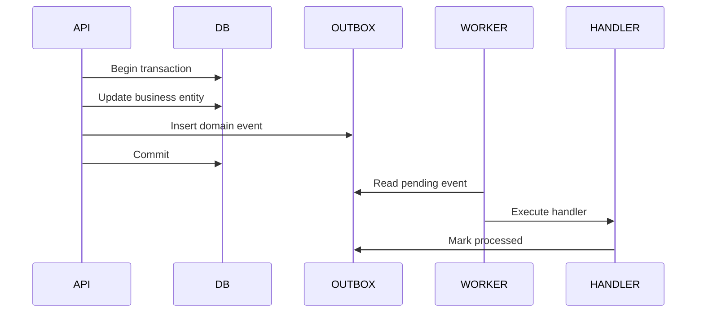
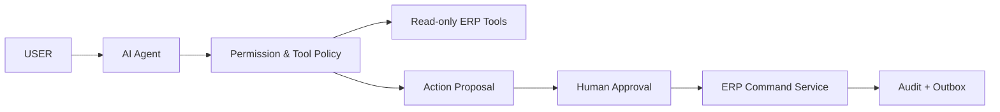

# Arsitektur DashAI

## 1. Gaya Arsitektur

DashAI menggunakan **modular monolith**. Semua modul berada dalam satu aplikasi backend dan satu database utama, tetapi setiap domain memiliki batas tanggung jawab yang jelas.

Alasan:

- lebih mudah dikembangkan oleh tim kecil;
- transaksi lintas modul masih dapat dijaga dalam satu database transaction;
- deployment lebih sederhana;
- test dan debugging lebih mudah;
- dapat dipecah menjadi service terpisah ketika beban dan organisasi sudah membutuhkan.

## 2. Struktur Tingkat Tinggi



## 3. Modul Backend

Struktur dasar:

```text
apps/backend/src/
├── core/
├── db/
├── modules/
│   ├── auth/
│   ├── company/
│   ├── users/
│   ├── products/
│   ├── crm/
│   ├── finance/
│   ├── hr/
│   ├── files/
│   ├── dashboard/
│   ├── sales/             # perlu ditambahkan
│   ├── procurement/       # perlu ditambahkan
│   ├── accounting/        # disarankan dipisahkan dari finance
│   ├── tax/               # perlu ditambahkan
│   ├── approvals/         # perlu ditambahkan
│   └── automation/        # perlu ditambahkan
├── security/
├── services/
├── events/
├── workers/
├── tests/
└── main.py
```

## 4. Layer Setiap Modul

Setiap modul idealnya memiliki:

```text
module_name/
├── models.py
├── schemas.py
├── repository.py
├── service.py
├── domain_service.py
├── commands.py
├── events.py
├── handlers.py
├── routes.py
└── tests/
```

### Routes

- menerima HTTP request;
- validasi input;
- memanggil application service;
- tidak menyimpan business rule kompleks.

### Application Service

- menjalankan use case;
- membuka transaction;
- memanggil domain service;
- menulis event ke outbox.

### Domain Service

- menyimpan aturan bisnis;
- tidak bergantung pada HTTP;
- dapat diuji tanpa web server.

### Repository

- query database;
- menerapkan tenant scope;
- tidak menentukan keputusan bisnis.

### Event Handler

- merespons event;
- menjalankan side effect atau proses lintas modul;
- harus idempotent.

## 5. Aturan Dependensi Modul

Modul tidak boleh mengakses tabel internal modul lain secara bebas.

Contoh yang benar:

```text
Sales -> InventoryService.reserve_stock()
Sales -> TaxService.calculate()
Sales -> AccountingService.post_document()
```

Contoh yang salah:

```text
Sales route langsung UPDATE stock_quantity
Sales route langsung INSERT journal_lines
```

## 6. Transaction Boundary

Proses yang wajib atomik:

- approve sales order + reserve stock;
- goods issue + stock movement;
- invoice posting + journal creation;
- payroll approval + payable journal;
- payment allocation + invoice balance update;
- tax calculation snapshot + transaction confirmation.

Side effect berikut boleh asynchronous:

- email;
- push notification;
- PDF generation;
- analytics projection;
- vector indexing;
- external webhook.

## 7. Transactional Outbox

Event penting ditulis ke tabel `outbox_events` dalam transaction yang sama dengan perubahan bisnis.



Ini mencegah kondisi ketika data berhasil disimpan tetapi event atau side effect hilang.

## 8. Frontend Architecture

```text
apps/frontend/
├── app/
├── components/
├── features/
│   ├── auth/
│   ├── product/
│   ├── crm/
│   ├── finance/
│   ├── hr/
│   ├── sales/
│   ├── procurement/
│   └── automation/
├── lib/
├── providers/
├── types/
└── hooks/
```

Prinsip:

- halaman hanya mengatur composition;
- query dan mutation berada di feature;
- API client tidak ditulis ulang di setiap halaman;
- domain type tidak memakai `any`;
- company scope ditentukan dari authenticated context;
- data sensitif tidak disimpan permanen di browser.

## 9. AI Architecture

AI berada di atas service layer, bukan mengakses database secara bebas.



Tahap awal AI hanya read-only dan recommendation-first.
