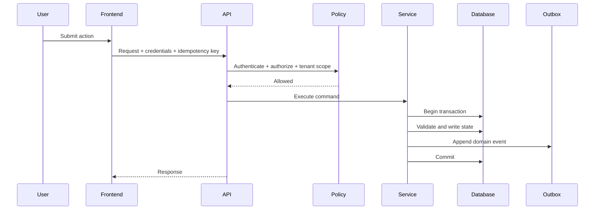
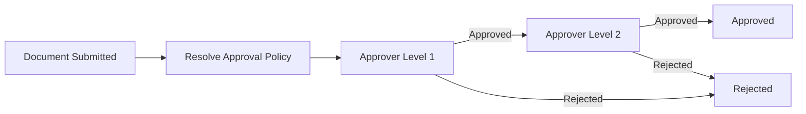

# Cara Kerja Sistem

## 1. Request Flow



## 2. Command, Event, dan Query

### Command

Perintah yang mengubah state:

```text
ApproveSalesOrder
IssueGoods
GenerateInvoice
ReceivePayment
ApprovePayroll
PostJournal
ChangeTaxRule
```

### Event

Fakta yang sudah terjadi:

```text
sales.order.approved
inventory.goods.issued
finance.invoice.issued
finance.payment.received
hr.payroll.approved
accounting.journal.posted
```

### Query

Pembacaan data tanpa mengubah state:

```text
GetOutstandingInvoices
GetStockAvailability
GetPayrollPreview
GetTaxSummary
GetCompanyCashflow
```

## 3. State Machine

Entity penting harus memakai transition eksplisit.

Contoh Sales Order:

```text
draft
  -> submitted
  -> approved
  -> stock_reserved
  -> fulfilled
  -> invoiced
  -> partially_paid
  -> paid
  -> closed
```

Transition alternatif:

```text
draft/submitted -> cancelled
approved -> rejected
stock_reserved -> reservation_released
```

Tidak boleh melakukan:

```text
draft -> paid
cancelled -> fulfilled
```

tanpa command khusus dan audit.

## 4. Approval Flow

Approval tidak hanya boolean.



Approval policy dapat ditentukan oleh:

- jenis dokumen;
- nilai transaksi;
- company;
- department;
- role;
- tax impact;
- exception risk.

## 5. Idempotency

Command eksternal yang dapat diulang harus menerima:

```text
Idempotency-Key
```

Contoh:

- create invoice;
- receive payment;
- goods issue;
- payroll posting;
- webhook;
- AI tool action.

Jika key yang sama digunakan ulang, sistem harus mengembalikan hasil lama dan tidak membuat transaksi ganda.

## 6. Audit

Minimal audit menyimpan:

```text
company_id
actor_user_id
action
entity_type
entity_id
before_data
after_data
request_id
ip_address
created_at
```

## 7. Background Processing

Cocok untuk:

- PDF invoice;
- payroll slip;
- email;
- notification;
- recurring invoice;
- reminder;
- report generation;
- AI embedding;
- vector re-indexing;
- webhook retry.

Jangan memindahkan ke background job jika operasi tersebut menentukan keberhasilan transaction utama.
