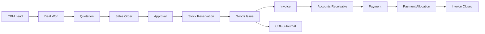
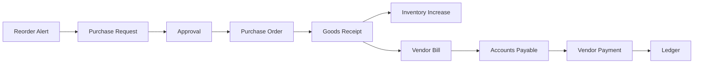
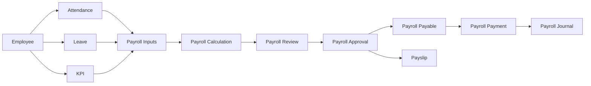
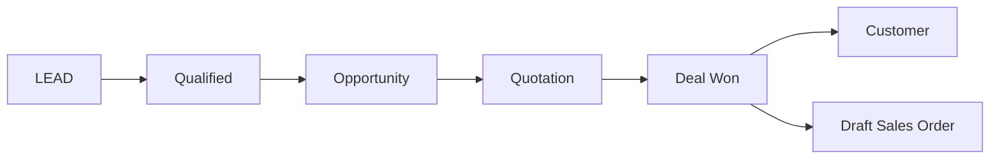
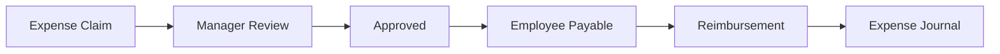

# Business Automation Blueprint

Dokumen ini mendefinisikan bagaimana modul saling terhubung secara otomatis.

## 1. Order-to-Cash

Flow default:



### Aturan Utama

1. Deal yang berstatus `won` dapat membuat draft sales order.
2. Sales order harus memiliki customer, item, quantity, price, tax profile, dan payment term.
3. Sales order submitted tidak boleh mengubah stok.
4. Sales order approved:
   - menjalankan approval policy;
   - menyimpan price snapshot;
   - menghitung tax snapshot;
   - mereservasi stok.
5. Goods issue:
   - mengurangi stock on hand;
   - mengurangi reserved stock;
   - membuat stock movement;
   - membuat jurnal COGS;
   - memicu invoice sesuai invoice policy.
6. Invoice:
   - membuat accounts receivable;
   - membuat jurnal revenue dan tax;
   - menghasilkan PDF;
   - mengirim notification.
7. Payment:
   - dialokasikan ke invoice;
   - mengurangi outstanding;
   - membuat journal bank/cash;
   - menutup invoice bila lunas.

### Invoice Trigger

Harus configurable per company:

```text
on_sales_order_approved
on_goods_issue_completed
on_delivery_confirmed
manual
```

Rekomendasi default:

```text
on_goods_issue_completed
```

Alasannya invoice baru terbit ketika barang benar-benar keluar.

### Jurnal

Goods issue:

```text
Debit  Cost of Goods Sold
Credit Inventory
```

Invoice:

```text
Debit  Accounts Receivable
Credit Sales Revenue
Credit Output Tax
```

Payment:

```text
Debit  Cash / Bank
Credit Accounts Receivable
```

## 2. Procure-to-Pay



### Trigger Otomatis

Jika:

```text
available_stock <= reorder_point
```

maka sistem dapat:

1. membuat reorder suggestion;
2. membuat draft purchase request;
3. memilih preferred supplier;
4. menghitung suggested quantity;
5. meminta approval.

Jangan langsung membuat purchase order tanpa approval kecuali company mengaktifkan auto-replenishment dan nilai berada di bawah limit.

## 3. Hire-to-Payroll



### Formula Dasar

```text
gross_pay =
  base_salary
  + fixed_allowances
  + overtime
  + performance_bonus
  + variable_allowances

deductions =
  absence_deduction
  + late_deduction
  + employee_tax
  + loan_deduction
  + other_deductions

net_pay = gross_pay - deductions
```

### KPI dan Payroll

KPI tidak mengubah `base_salary` secara langsung.

KPI memengaruhi komponen:

```text
performance_bonus
performance_multiplier
performance_penalty
```

Contoh policy:

```text
score >= 90  -> bonus 15%
score >= 80  -> bonus 10%
score >= 70  -> bonus 5%
score < 60   -> no bonus, review required
```

Policy harus configurable, memiliki effective date, dan menyimpan snapshot saat payroll dihitung.

### Attendance

Attendance period harus ditutup sebelum payroll final.

Data yang memengaruhi payroll:

- hadir;
- terlambat;
- absen;
- overtime;
- unpaid leave;
- paid leave;
- shift differential.

## 4. Tax Automation

Tax engine harus generik dan configurable.

### Tax Rule

```text
name
code
rate
calculation_basis
inclusive_or_exclusive
withholding
compound
effective_from
effective_to
threshold
rounding_mode
company_id
```

### Contoh

Exclusive tax:

```text
subtotal = 1,000,000
rate = 11%
tax = 110,000
total = 1,110,000
```

Inclusive tax:

```text
gross = 1,110,000
tax = gross - gross / 1.11
net = gross - tax
```

### Aturan

1. Gunakan `Decimal`, bukan float.
2. Tax rule disimpan sebagai snapshot pada invoice.
3. Perubahan tax rate tidak mengubah transaksi lama.
4. Rule harus memiliki effective date.
5. Tax dapat diterapkan pada line item atau document.
6. Tax payable dan tax receivable harus dipisahkan.
7. Perubahan tax profile memerlukan permission dan audit.

## 5. CRM-to-Sales



Data yang harus dibawa:

- customer;
- contact;
- product;
- proposed quantity;
- negotiated price;
- discount;
- tax profile;
- expected closing date;
- salesperson.

## 6. Expense-to-Reimbursement



## 7. Return and Refund

Sales return:

```text
Return Request
-> Approval
-> Goods Receipt
-> Stock Adjustment
-> Credit Note
-> Refund or Invoice Offset
-> Journal
```

Purchase return:

```text
Supplier Return
-> Goods Issue
-> Stock Adjustment
-> Debit Note
-> AP Offset
-> Journal
```

## 8. Period Closing

```text
Open
-> Soft Close
-> Review
-> Hard Close
-> Locked
```

Setelah hard close:

- transaction baru tidak boleh masuk ke periode lama;
- perubahan memerlukan reopen permission;
- adjustment menggunakan adjusting journal.
