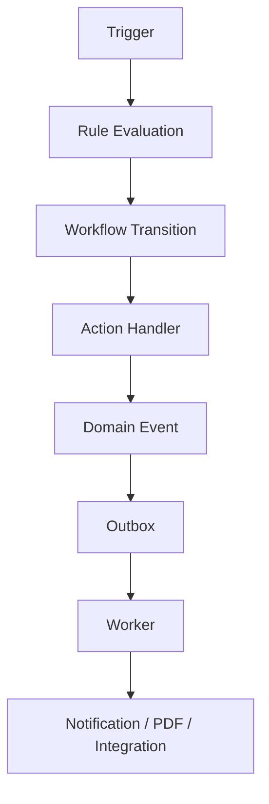

# Automation Engine

Automation engine menjalankan proses bisnis struktural tanpa bergantung pada AI.

## 1. Komponen



## 2. Jenis Trigger

- domain event;
- perubahan status;
- scheduler;
- threshold;
- webhook;
- manual command;
- approval completion.

Contoh:

```text
sales.order.approved
inventory.stock_below_reorder_point
hr.payroll_period_closed
finance.invoice.overdue
tax.rule.effective
```

## 3. Rule Definition

Tabel `automation_rules`:

```text
id
company_id
name
trigger_event
conditions_json
actions_json
priority
is_active
effective_from
effective_to
created_by
created_at
```

Contoh:

```json
{
  "trigger_event": "inventory.stock_below_reorder_point",
  "conditions": {
    "supplier_id": {"not_null": true},
    "suggested_value": {"lte": 5000000}
  },
  "actions": [
    {
      "type": "create_purchase_request",
      "requires_approval": true
    }
  ]
}
```

## 4. Workflow Definition

Tabel:

```text
workflow_definitions
workflow_states
workflow_transitions
workflow_instances
workflow_history
```

Transition mendefinisikan:

```text
from_state
to_state
command
required_permission
approval_policy_id
guard_expression
side_effect_policy
```

## 5. Synchronous vs Asynchronous

### Synchronous

Gunakan ketika kegagalan harus membatalkan transaction:

- validate stock;
- reserve stock;
- calculate tax;
- validate accounting balance;
- update invoice outstanding;
- validate payroll period.

### Asynchronous

Gunakan untuk:

- notification;
- PDF;
- reminder;
- webhook;
- analytics projection;
- AI indexing.

## 6. Event Retry

Outbox event memiliki:

```text
pending
processing
processed
failed
dead_letter
```

Retry:

```text
attempt_count
next_retry_at
last_error
```

Gunakan exponential backoff.

## 7. Idempotent Handler

Setiap handler harus menyimpan:

```text
consumer_name
event_id
processed_at
```

Jika event yang sama diproses ulang, handler tidak menghasilkan output ganda.

## 8. Scheduler

Scheduler cocok untuk:

- invoice overdue;
- recurring invoice;
- payroll period close;
- tax filing reminder;
- contract expiry;
- stock aging;
- reorder check;
- backup verification;
- AI summary generation.

## 9. Approval Engine

Approval policy:

```text
document_type
minimum_amount
maximum_amount
department
role
step_order
approver_type
required_count
```

Contoh:

```text
Sales order <= 5 juta:
  Supervisor

Sales order > 5 juta:
  Supervisor -> Finance Manager

Purchase order > 50 juta:
  Procurement Manager -> Finance Manager -> Owner
```

## 10. Automation Safety

Automation tidak boleh:

- melewati tenant scope;
- membuat jurnal tidak seimbang;
- membuat stok negatif tanpa policy;
- mengulang payment;
- mengubah transaksi closed period;
- mengeksekusi action tanpa permission;
- menjalankan rule tanpa version snapshot.
