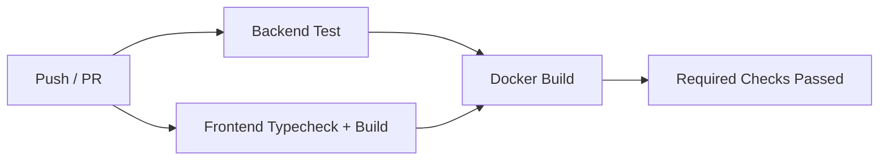

# Testing and CI

## 1. Test Pyramid

### Unit

Uji domain rule:

- tax calculation;
- payroll formula;
- state transition;
- stock availability;
- approval routing;
- journal balance.

### Integration

Uji:

- database;
- Redis;
- transaction;
- API;
- migrations;
- outbox;
- event handlers.

### Contract

Uji:

- route tersedia;
- schema request-response;
- frontend-backend field mapping;
- permission;
- tenant scope.

### End-to-End

Flow minimum:

1. login;
2. create customer;
3. create sales order;
4. approve;
5. goods issue;
6. invoice;
7. payment;
8. ledger verification.

## 2. Mandatory Tests per Feature

Setiap fitur baru minimal memiliki:

```text
happy path
validation error
permission denied
cross-tenant access denied
duplicate/idempotency case
invalid state transition
rollback case
audit record
event emitted
```

## 3. Financial Invariants

```text
sum debit = sum credit
invoice outstanding >= 0
stock available >= 0 unless explicitly allowed
payment allocation <= payment amount
payment allocation <= invoice outstanding
payroll net = gross - deductions
tax snapshot immutable after posting
```

## 4. CI Pipeline



## 5. Required GitHub Checks

- backend tests;
- frontend TypeScript;
- frontend lint;
- frontend production build;
- Docker backend build;
- Docker frontend build;
- migration check;
- secret scan;
- dependency audit.

## 6. Coverage Target

Target bertahap:

```text
Domain services: >= 90%
Application services: >= 80%
Routes: >= 70%
Frontend critical flow: covered by E2E
```

Coverage bukan satu-satunya kualitas. Invariant bisnis lebih penting.

## 7. Test Data

Seed harus:

- idempotent;
- tenant-aware;
- deterministic;
- tidak bergantung pada urutan acak;
- aman dijalankan ulang.
